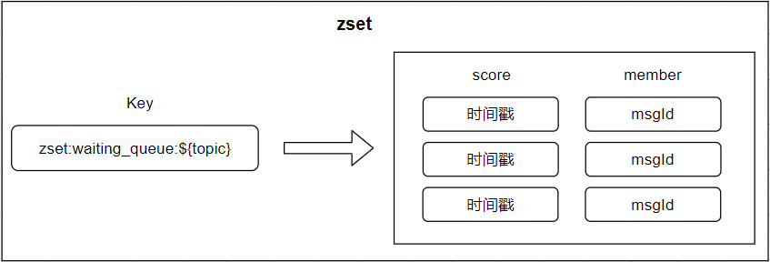
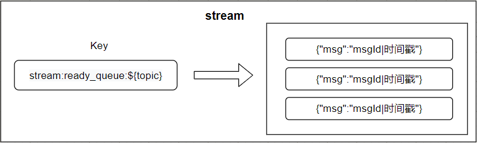
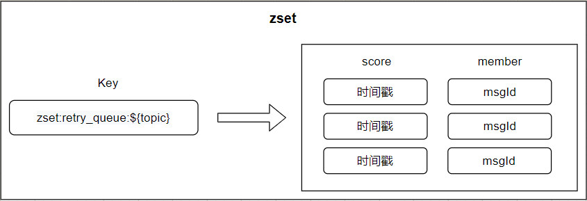
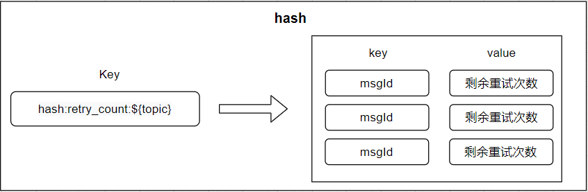
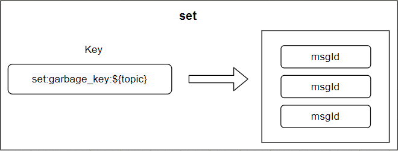
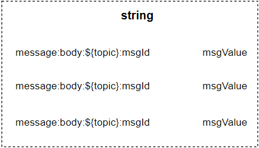
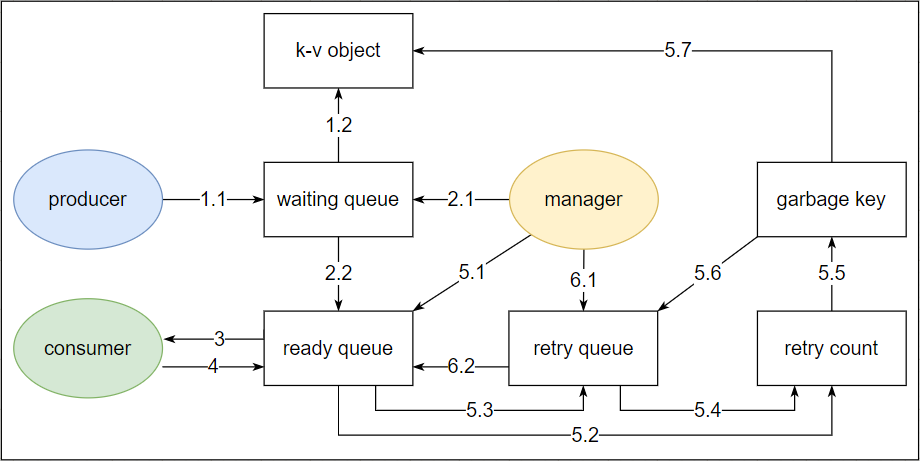

# lisa-delay-queue
## 项目介绍

基于redis-stream实现的延迟消息队列，可投入生产环境使用。

本来想取名redis stream delay queue的，不过太不个性了，因此给这个项目取名叫Lisa。

别问我Lisa是谁，Lisa是万里挑一的那个你我她。


该项目包含三个服务：`manager`、`producer`、`consumer`，各自分工明确。

`manager`负责消息的调度，包括消息重试，队列长度修剪（因为stream是不会自动清理掉已经消费过的消息的，所以需要手动修剪）

`producer`是消息的生产者。除了生产消息，什么都不做。

`consumer`是消息的消费者。除了消费消息（也包括ack），什么都不做。

该项目分别封装了三个服务的boot-starter模块，所以只要引入maven依赖并且启动类注解加上`@SpringBootApplication`就可以正常使用了。

------

项目依赖Redis，使用到Redis的数据结构有：zset、stream、hash、string。

##### 所有针对redis复杂的数据操作（例如一次操作中包含数据转移，删除等操作）都是基于redis脚本的，保证原子化操作。

数据结构如下：

#### waiting queue（等待队列）

数据结构zset。field是msgId，score是延迟消息触发时间。

`manager`会定时扫描waiting queue中的元素，当到达延迟消息发送时间后（即score小于等于当前时间戳），会将该记录从waiting queue中移除并加入到ready queue中。数据结构如下图：




#### ready queue（就绪队列）

数据结构stream。不做任何操作，完全交给consumer去消费，consumer关闭了自动ack机制，需要手动ack（没有异常就ack了）。数据结构如下图




#### retry queue（重试队列）

数据结构zset。

`manager`会定期扫描一段时间ready queue中未ack的数据，然后从stream中移除，如果msgId的重试次数未不为0，则放入retry queue，如果为0，说明已经消耗完了所有的重试次数，msgId会被打入冷宫（移动到garbage中），用于复查问题。

`manager`也会定期扫描到达重试时间的数据，将此类数据从重试队列中移除，放入ready queue中。

数据结构如下图：



可以看到数据结构跟waiting queue的数据结构一样，只是Key的前缀不一样。


#### retry count（重试次数）

数据结构hash。用于存储msgId剩余的重试次数。数据结构如下图




#### garbage key（垃圾key）

数据结构set。用于存储重试失败并被废弃的msgId。这里的数据不会再被使用，需要手动check。数据结构如下图：




#### K-V

存储关系：MessageId--MessageBody。

前几种数据格式仅仅存储MessageId（即msgId），而真正的消息对象是以KV形式存储的（在redis中的数据类型是string）。

当ready queue中的消息被正常消费并收到ack消息之后，msgId对应的对象才会被删除。



用虚线是因为string类型跟其他数据类型不一样，并不是集合类型数据

------

### 关于Manager（消息管理者）

该服务内置三个定时任务，分别如下：

1. 将消息从waiting queue或者retry queue移动到waiting queue；
2. 将pending的消息移动到retry queue；
3. 清理stream中已经消费完（已经ack）的数据。已经消费完的数据，redis是不会自动帮忙清理的，所以需要手动清理。

相关通讯图如下：



#### 描述如下（每一个分割线都是基于lua脚本的原子操作）

- 1.1 producer生产消息，msgId存储到waiting queue
- 1.2 msg body存储到 k-v object

------

- 2.1 manager扫描waiting queue中的数据，判断是否到达发送时间
- 2.2 如果消息到达发送时间，将消息从waiting queue中移动到ready queue中

------

- 3 consumer消费ready queue的消息

------

- 4 如果成功消费，则进行ack处理

------

- 5.1 manager扫描ready queue中ack超时的pending数据

- 5.2 检查pending数据的retry count
- 5.3 如果retry count未用完，则将pending数据从ready queue移动到retry queue
- 5.4 移动后，将pending数据的retry count做减1处理
- 5.5 如果retry count已用完，则将该数据的msgId加入到garbage key中，并将msgId对应的retry count删除
- 5.6 同时将该数据从retry queue中清理掉
- 5.7 删除前缀+topic+msgId对应的对象

------

- 6.1 manager扫描retry queue中的数据，判断是否到达重试时间
- 6.2 如果消息到达重试时间，将消息从retry queue中移动到ready queue中

------


### 如何使用

为了方便上手，三个项目各有一个`demo`用于演示如何使用。感兴趣的同学可以跑一下demo。

另外，有的时候为了节省服务器资源，可以把producer和manager合并，参考`lisa-delay-queue-producer-and-manager`，该项目整合了`producer`和`manager`的配置项，可以部署到一个应用服务中。

#### maven依赖

当服务端项目作为producer使用时，引入依赖如下：

```xml
<dependency>
    <groupId>org.lisa.stream</groupId>
    <artifactId>lisa-delay-queue-producer-spring-boot-starter</artifactId>
    <version>1.0.0</version>
</dependency>
```


当服务端作为consumer使用时，引入依赖如下：

```XML
<dependency>
    <groupId>org.lisa.stream</groupId>
    <artifactId>lisa-delay-queue-consumer-spring-boot-starter</artifactId>
    <version>1.0.0</version>
</dependency>
```


当服务端作为manager使用时，引入依赖如下：

```XML
<dependency>
    <groupId>org.lisa.stream</groupId>
    <artifactId>lisa-delay-queue-manager-spring-boot-starter</artifactId>
    <version>1.0.0</version>
</dependency>
```


#### 生产消息

producer提供了开箱即用的工具类，方法如下：

```java
/**
 * @description: 发送消息工具类
 * @author: wuxu
 * @createDate: 2022/10/1
 */
public class PublishMessageUtil {

    /** 发送消息（相当于立刻发送）
     * @param topic Message Topic，即producer yaml文件里配置的topic，因为支持配置多个消息分组，因此使用哪个topic需要指定
     * @param msg Message Body
     * @param <T> 消息体中的对象类型
     */
    public static <T> void sendMessage(String topic, Message<T> msg) {
        sendMessage(topic, msg, System.currentTimeMillis());
    }

    /**
     * 在指定时间发送消息
     * @param topic Message Topic，即producer yaml文件里配置的topic，因为支持配置多个消息分组，因此使用哪个topic需要指定
     * @param msg Message Body
     * @param expectAt 期望发送时间（毫秒数时间戳，默认当前系统时区）
     * @param <T> 消息体中的对象类型
     */
    public static <T> void sendMessage(String topic, Message<T> msg, long expectAt) {
        Producer.STREAM_MAP.get(topic).send(msg);
    }

    /**
     * 在指定时间发送消息
     * @param topic Message Topic，即producer yaml文件里配置的topic，因为支持配置多个消息分组，因此使用哪个topic需要指定
     * @param msg Message Body
     * @param expectAt 期望发送时间（默认当前系统时区）
     * @param <T> 消息体中的对象类型
     */
    public static <T> void sendMessage(String topic, Message<T> msg, LocalDateTime expectAt) {
        sendMessage(topic, msg, expectAt.toInstant(ZoneOffset.ofHours(8)).toEpochMilli());
    }

    /**
     * 在指定时间发送消息
     * @param topic Message Topic，即producer yaml文件里配置的topic，因为支持配置多个消息分组，因此使用哪个topic需要指定
     * @param msg Message Body
     * @param expectAt 期望发送时间
     * @param zoneOffset 时区
     * @param <T> 消息体中的对象类型
     */
    public static <T> void sendMessage(String topic, Message<T> msg, LocalDateTime expectAt, ZoneOffset zoneOffset) {
        sendMessage(topic, msg, expectAt.toInstant(zoneOffset).toEpochMilli());
    }
}
```


#### 消费消息

基于spring event强大的解耦神器

consumer的stream listener收到消息之后，会将消息封装成`MessageEvent`并发布spring event，代码片段：`applicationEventPublisher.publishEvent(new MessageEvent(topic, body));`


业务代码只要监听（实现）`ApplicationListener<MessageEvent>`即可，然后根据不同的`topic`处理不同的业务逻辑，参考如下：

```java
@Slf4j
@Service
public class DemoService implements ApplicationListener<MessageEvent> {

    @SneakyThrows
    @Override
    public void onApplicationEvent(MessageEvent event) {
        log.info("[DemoService#onApplicationEvent], event -> {}", event);
        String topic = event.getTopic();
        Object source = event.getSource();
        log.info("topic:{}, source -> {}", topic, source);
        // 可以根据不同的topic处理不同的业务逻辑
        
        
        Message<String> message = JSONObject.parseObject(String.valueOf(source), new TypeReference<Message<String>>(){

        });
        log.info("message -> {}", message);
        Class<?> clazz = message.getClazz();
        if(User.class.equals(clazz)){
            User user = JSONObject.parseObject(message.getBody(), User.class);
            log.info("user -> {}", user);
        }
        if(OrderInfo.class.equals(clazz)){
            OrderInfo orderInfo = JSONObject.parseObject(message.getBody(), OrderInfo.class);
            log.info("orderInfo -> {}", orderInfo);
        }
    }
}
```


------

### 配置文件

#### manager应用服务配置

```yaml
lisa-delay-queue:
  manager-server:
    # manager将消息从waiting queue或者retry queue移动到ready queue的时间间隔，目前配置为1秒1次
    crontab-move-to-ready-queue: '0/1 * * * * ?'
    # manager修剪stream长度的定时任务，目前配置为1分钟1次
    crontab-clean-stream: '0 */1 * * * ?'
    # manager扫描pending消息（未及时ack）的时间间隔，目前配置为5秒1次
    crontab-process-pending-message: '0/5 * * * * ?'
    # 命令举例：xpending stream:ready_queue:mystream group-1 - + 20
    # range-start、range-end、count 就是上述命令中的 - + 20
    range-start: '-'
    range-end: '+'
    count: 20
    # pending多久后算超时，开始进行超时处理，目前配置为10000ms
    timeout: 10000
    # 对于pending的消息，延迟多久后重试，目前配置为20000ms
    delay-time: 20000
    # 最大重试次数
    max-retry-count: 10
  # enabed为true时才会在项目启动时运行
  enabled: true
  # 消息分组列表，支持多个分组
  groups:
      # 消息的topic
    - topic: mystream
      # 消息分组名称
      group: group-1
      # 消费者名称
      consumer: consumer-1
      # stream修剪时保留的长度
      max-length: 10000
    - topic: topic2
      group: group-2
      consumer: consumer-2
      max-length: 10000
```


#### producer应用服务配置

```yaml
lisa-delay-queue:
  # enabed为true时才会在项目启动时运行
  enabled: true
  groups:
    - topic: mystream
      group: group-1
    - topic: topic2
      group: group-2
```


#### consumer应用服务配置

```yaml
lisa-delay-queue:
  # enabed为true时才会在项目启动时运行
  enabled: true
  # consumer的server相关配置
  consumer-server:
    # 消息拉取超时时间(单位ms)
    pollTimeoutMillis: 5000
    # 批量抓取消息数量
    pollBatchSize: 10
  groups:
      # 消息的topic
    - topic: mystream
      # 消息的分组
      group: group-1
      # 消费者名称
      consumer: consumer-1
    - topic: topic2
      group: group-2
      consumer: consumer-2
```

